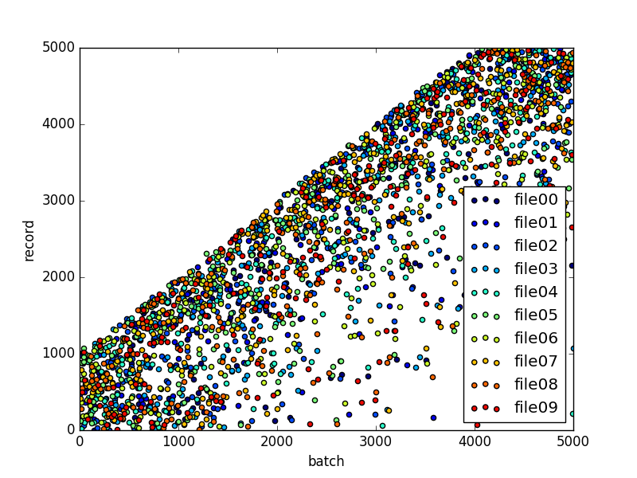

# minibatch_TFRecord

* TFRecordファイルを入力とした`tf.train.shuffle_batch`の偏りを調べるスクリプトです。
* ここで言う偏り＝同じミニバッチ内でどれ位同じTFRecordファイルに含まれるファイルが有るか

## dependencies

* python2.7
* tensorflow
* numpy
* matplotlib

## usage

### テスト用TFRecordファイルの保存

```sh
$ mkdir data
$ ./create_tfrecords.py data
```

### テスト用TFRecordを使ったshuffle_batch

```sh
$ ./visualize_mini_batch.py data tensorboard_log_dir
```

## result


横軸がバッチのインデックス、縦軸がレコードのインデックス、色がファイルを表します。
散布図の一点が１データを表し、何番目のバッチでどのファイルの何番目のデータが出てきたかを示しています。

※全データ点の5%のみ表示します

### 例

以下の結果では、バッチ前半で各ファイルの前半のデータが出現し、
バッチ後半で各ファイルの後半のデータが出現していることがわかります。


